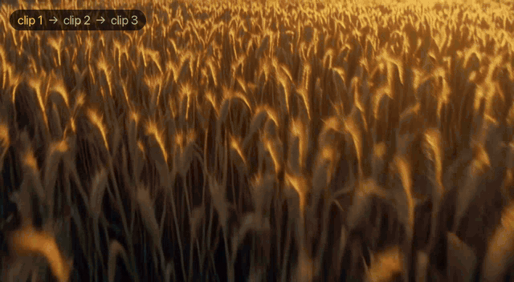
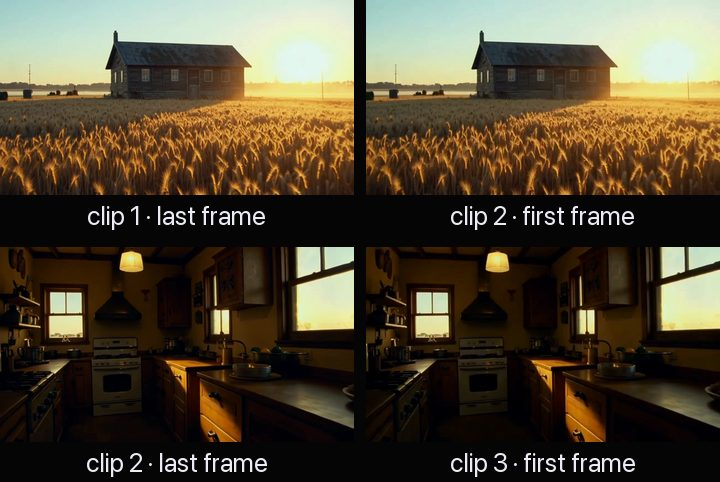
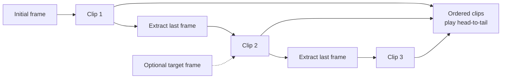

# fxi-frame-chain: seamless AI video with frame chaining

**Chain AI video clips into one continuous shot. Every clip starts on the exact last frame of the clip before it, so 2–8 image-to-video generations play back with no visible cut. Works with ComfyUI or any backend you plug in.**

[](https://www.fxi.studio/tutorials/frame-chaining-storyboard-to-continuous-shot?utm_source=github&utm_medium=oss&utm_campaign=frame-chain&utm_content=example-output)

<sub>Three separate generations, chained: clip 1 → clip 2 → clip 3 (shown at 2x). Each clip was generated from the previous clip's last frame. Made with FXI Studio.</sub>

> **Don't want to run GPUs?** Frame chaining runs fully hosted on **FXI Studio**, alongside R2V, DUET, and more. **[See the full frame-chaining walkthrough →](https://www.fxi.studio/tutorials/frame-chaining-storyboard-to-continuous-shot?utm_source=github&utm_medium=oss&utm_campaign=frame-chain&utm_content=readme-top)**

---

## Why frame chaining

Image-to-video models generate one clip at a time and forget everything in between. Stitch three generations together and you get three shots that jump at every cut: the light shifts, the camera snaps to a new position, objects move. Most AI video looks like a slideshow for this reason.

Frame chaining fixes it with one rule: **start the next clip from the real last frame of the previous clip.** The model continues from exactly the pixels the last clip ended on, so the camera never cuts. That lets you:

- **Build shots longer than any single generation.** A 5-second model can produce a 40-second continuous move.
- **Direct a camera path across scenes.** Push through a window, walk down a hall, drift from exterior to interior.
- **Hit specific story beats.** Give any scene an optional target frame, and first-last frame (FLF) models will land on it.
- **Keep continuity without special models.** Any model that accepts a start image works.

The seam, frame by frame. Each clip's last frame and the next clip's first frame match:



## How it works



1. Clip 1 is generated from your **initial frame** and scene 1's prompt.
2. `ffmpeg` pulls the **exact last decoded frame** out of clip 1. It selects the frame by index rather than guessing a timestamp, so variable frame rate files work too.
3. That frame becomes the **first frame** of clip 2. This repeats for up to 8 scenes.
4. Any scene can also provide a **target frame** to end on, if your model supports first/last-frame generation.

The result is an ordered list of clips that cut together seamlessly. The rest of the code (validation, retries, resuming) makes that loop safe to run.

## Quickstart

Requirements: **Node.js 20.3+**, **ffmpeg** on your `PATH`, and (for real generations) a local **ComfyUI** with an image-to-video model.

```bash
git clone https://github.com/fueledximagination/fxi-frame-chain.git
cd fxi-frame-chain
npm test                      # no GPU needed: runs against a mocked backend
node examples/mock-chain.js   # watch the loop run end-to-end with a toy ffmpeg "model"
```

There are no npm dependencies to install.

### Run it against ComfyUI

1. Start ComfyUI (default `http://127.0.0.1:8188`). To use another address, `export COMFYUI_URL=...` or copy `.env.example` to `.env` and run with `node --env-file=.env ...`.
2. Take an image-to-video (or first/last-frame) workflow that already works for one clip. Add the placeholder tokens (`{{FIRST_FRAME}}`, `{{PROMPT}}`, `{{NUM_FRAMES}}`, ...) described in [workflows/README.md](workflows/README.md). Export it with **Save (API Format)**.
3. Put your starting image at `./start-frame.png` and edit `examples/scenes.example.json`.
4. Run:

```bash
node examples/basic-chain.js examples/scenes.example.json my-workflow.api.json
# or the CLI:
node bin/fxi-frame-chain.js run examples/scenes.example.json \
  --workflow my-workflow.api.json --out ./frame-chain-output
```

Clips are written to `./frame-chain-output/clips/` and extracted frames to `./frame-chain-output/frames/`.

## The request

```json
{
  "initial_frame_uri": "./start-frame.png",
  "scenes": [
    { "prompt": "Slow dolly toward a lighthouse at dusk", "duration_seconds": 5 },
    { "prompt": "Keep pushing in to the lantern room", "target_frame_uri": "https://example.com/lantern.png" }
  ],
  "aspect_ratio": "16:9",
  "idempotency_key": "lighthouse-001",
  "speed_ramping": true
}
```

| Field | Type | Rules |
|---|---|---|
| `initial_frame_uri` | string | `https://` URL or local file path. Anchors clip 1. |
| `scenes` | array | 2–8 items, played in order. |
| `scenes[].prompt` | string | Required. |
| `scenes[].duration_seconds` | number | 3–10, default 5. |
| `scenes[].target_frame_uri` | string | Optional frame for the clip to end on (`https://` or local path). |
| `aspect_ratio` | `16:9` \| `9:16` \| `1:1` | Default `16:9`. Applied to every clip. |
| `idempotency_key` | string | Up to 200 characters. Re-running with the same key skips finished clips. |
| `speed_ramping` | boolean | Metadata hint for editing: play transitions at 2x and detail holds at 1x. The chain does not re-time clips itself; apply it with [`ramp`](#speed-ramping-2x-travel-1x-hold). |

Only `https://` URLs and local paths are accepted. Other URI schemes, including plain `http://`, are rejected. To check a request without generating anything, run `node bin/fxi-frame-chain.js validate my-request.json`.

## Retries and idempotency

Generations fail: out-of-memory errors, crashed servers, closed laptops. Each run writes a manifest to `<out>/.frame-chain/`, keyed by `idempotency_key` (or by a hash of the request if you don't set one). Run the same request again and finished clips are skipped. The chain resumes at the first missing clip, starting from the last frame already saved. Reusing a key with a *different* request is an error, so clips from two requests never get mixed. A lock file stops two processes from running the same chain at once.

## Bring your own backend

The chaining loop is not tied to ComfyUI. A backend is one method:

```js
import { runChain, VideoBackend } from './src/index.js';

class MyBackend extends VideoBackend {
  async generateClip({ firstFramePath, targetFramePath, prompt, durationSeconds, aspectRatio, outputPath }) {
    // call your model / server; write the clip to outputPath
    return { path: outputPath };
  }
}

const { clips } = await runChain(request, { backend: new MyBackend(), outDir: './out' });
```

[`src/adapters/base.js`](src/adapters/base.js) documents the full contract. [`src/adapters/comfyui.js`](src/adapters/comfyui.js) is the reference adapter and uses the standard ComfyUI API: `POST /upload/image`, `POST /prompt`, `GET /history/{id}`, `GET /view`.

## Stitch the chain into one video

```bash
node bin/fxi-frame-chain.js stitch frame-chain-output/clips/scene-*.mp4 -o film.mp4
```

Clips are joined in the order given. The fast lossless path, a stream copy with no re-encode, is tried first. It is only used when every clip has the same codec, resolution, pixel format and frame rate. The output duration is also checked against the sum of the clips, because ffmpeg can "succeed" on a mismatch and still write broken timing. If any check fails, the clips are re-encoded automatically. Pass `--reencode` to skip straight to that. The output is video only; AI clips are often silent or carry mismatched audio.

In code: `await stitchClips(result.clips, 'film.mp4')`.

The plain-ffmpeg equivalent, if you'd rather not use the CLI:

```bash
for f in scene-*.mp4; do echo "file '$f'"; done > list.txt
ffmpeg -f concat -safe 0 -i list.txt -c copy film.mp4
```

## Speed ramping: 2x travel, 1x hold

Chained shots often have a "travel" part (the camera pushing between beats) and a "hold" (the detail you want the viewer to absorb). A two-speed ramp makes them feel edited instead of generated:

```bash
node bin/fxi-frame-chain.js ramp scene-02.mp4 -o scene-02.ramped.mp4 --fast 2 --hold 1 --split 3
```

This plays the first 3 seconds at 2x and the rest at 1x. `--split` defaults to the middle of the clip. When a request sets `speed_ramping: true`, this is the edit it refers to. In code: `await speedRamp(clip, out, { fast: 2, hold: 1, split: 3 })`. The output is video only.

To grab a single last frame by hand: `node bin/fxi-frame-chain.js last-frame clip.mp4 -o last.png`.

## What this repo is and isn't

**It is** the frame-chaining technique as a small, readable reference implementation. It contains the chaining loop, exact last-frame extraction, request validation, resumable retries, a backend interface, one adapter for a local ComfyUI, and the finishing tools: stitch and speed ramp.

**It isn't** the FXI Studio platform. It has no hosted models, queues, accounts, or tuned model settings. Output quality depends entirely on the model and workflow you bring. It is provided as-is, without warranty or support commitments.

## Contributing

Issues and pull requests are welcome; see [CONTRIBUTING.md](CONTRIBUTING.md). To report a security problem, see [SECURITY.md](SECURITY.md).

---

> **Want the version that just works?** Frame chaining runs fully hosted on **FXI Studio**, alongside R2V, DUET, and more. There are no GPUs or workflows to maintain. **[See the full walkthrough →](https://www.fxi.studio/tutorials/frame-chaining-storyboard-to-continuous-shot?utm_source=github&utm_medium=oss&utm_campaign=frame-chain&utm_content=readme-bottom)**

## License

[MIT](LICENSE) © 2026 FUELED BY IMAGINATION, LLC. The MIT license covers this code only. "FXI" and "FXI Studio" and their logos are trademarks of FUELED BY IMAGINATION, LLC and are not licensed under MIT. Forks must not use them in a way that suggests endorsement. The demo media in `docs/` (`demo.gif`, `seams.jpg`) was generated with FXI Studio. It is © FUELED BY IMAGINATION, LLC, all rights reserved, and is not covered by the MIT license.
